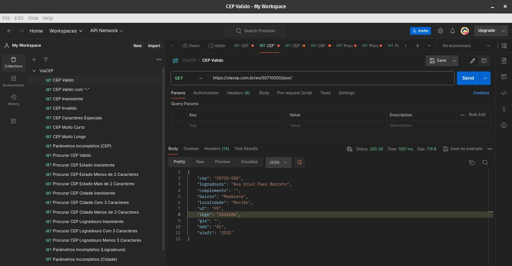
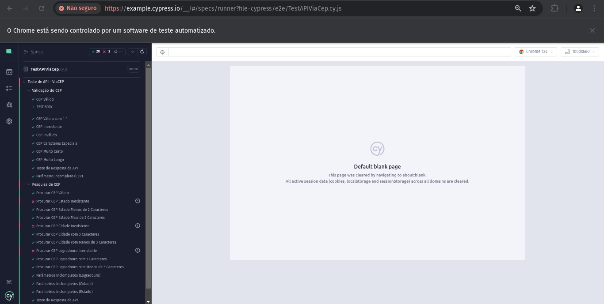

# ViaCEP
### Automatização de Testes de API do ViaCEP:

Este guia tem como função documentar todo o passo a passo realizado durante a elaboração da automação da API do ViaCEP, com a finalidade de colaborar e guiar a pessoa que planeja entender o projeto.

### Jornada:
Primeiramente, li toda a descrição do desafio, onde pude compreender quais eram os requisitos solicitados e as necessidades do mesmo.
Logo após, entrei no site do ViaCEP para imergir e compreender a sua API, saber como funcionava, as suas funções, utilidades e limitações.
Com todo esse embasamento prévio, consegui ter background suficiente para começar a elaborar os meus cenários de teste. 
Dividi os cenários em "Validação do CEP" e "Pesquisa de CEP", ja que possuem URLs e comportamentos diferentes.
Em validação do cep, consegui mapear 9 cenários de testes, e em pesquisa de CEP, 14 cenários possíveis.
Baseado nas tecnicas de BDD e Gherkin elaborei os seguintes cenários:

#### Validação do CEP:

| Cenário de Teste             | Dado                                   | Quando                                  | Então                                                                    | Status |
| ---------------------------- | -------------------------------------- | --------------------------------------- | ------------------------------------------------------------------------ | ------ |
| CEP Válido                   | Um CEP válido                          | Quando fizermos a requisição o passando | É esperado retornar sucesso na requisição                                | OK     |
| CEP Válido com "-"           | Um CEP válido com "-"                  | Quando fizermos a requisição o passando | É esperado retornar sucesso na requisição                                | OK     |
| CEP Inexistente              | Um CEP inexistente                     | Quando fizermos a requisição o passando | É esperado retornar sucesso com o body contendo o valor de "erro = true" | OK     |
| CEP Ccm Caracteres Especiais | Um CEP com Caracteres especiais        | Quando fizermos a requisição o passando | É esperado retornar erro indicando que o formato do CEP é inválido       | OK     |
| CEP Muito Curto              | Um CEP com menos de 8 digitos          | Quando fizermos a requisição o passando | É esperado retornar erro indicando que o formato do CEP é inválido       | OK     |
| CEP Muito Longo              | Um CEP com mais de 8 digitos           | Quando fizermos a requisição o passando | É esperado retornar erro indicando que o formato do CEP é inválido       | OK     |
| Resposta da API              | Um CEP válido                          | Quando fizermos a requisição o passando | É esperado retornar sucesso indicando que o body é realmente um array    | OK     |
| Parâmetro Incompleto (CEP)   | Que nenhum CEP é passado na requisição | Quando enviarmos a requisição           | É esperado retornar erro indicando que o CEP é obrigatorio               | OK     |

#### Pesquisa de CEP:

| Cenário de Teste             | Dado                                   | Quando                                  | Então                                                                    | Status |
| ---------------------------- | -------------------------------------- | --------------------------------------- | ------------------------------------------------------------------------ | ------ |
| Procurar CEP Válido                   | Um Estado, Cidade e Logradouro válido | Quando fizermos a requisição o passando | É esperado retornar sucesso na requisição                                | OK     |
| Procurar CEP com Estado Inexistente           | Um Estado Inexistente                  | Quando fizermos a requisição o passando | É esperado retornar erro indicando que o estado é inválido                                | ERRO     |
| Estado com Menos de 2 Caracteres              | Um Estado com Menos de 2 caracteres                     | Quando fizermos a requisição o passando | É esperado retornar erro indicando que o estado é inválido pois tem que ter 2 caracteres | OK     |
| Estado com Mais de 2 Caracteres | Um Estado com Mais de 2 caracteres        | Quando fizermos a requisição o passando | É esperado retornar erro indicando que o estado é inválido pois tem que ter 2 caracteres       | OK     |
| Procurar CEP com Cidade Inexistente              | Uma Cidade Inexistente          | Quando fizermos a requisição o passando | É esperado retornar erro indicando que o estado é inválido       | ERRO |
| Cidade com Menos de 3 Caracteres              | Uma Cidade com Menos de 3 caracteres           | Quando fizermos a requisição o passando | É esperado retornar erro indicando que a cidade é inválida pois tem que ter pelo menos 3 caracteres       | OK     |
| Cidade com 3 Caracteres                 | Uma cidade com 3 caracteres                         | Quando fizermos a requisição o passando | É esperado retornar sucesso na requisição    | OK  |
| Procurar CEP com Logradouro Inexistente | Um Logradouro Inexistente | Quando o enviarmos             | É esperado retornar erro indicando que o Logradouro é inválido               | ERRO     |
| Logradouro com Menos de 3 Caracteres    | Um Logradouro com Menos de 3 Caracteres | Quando fizermos a requisição o passando | É esperado retornar erro indicando que o Logradouro é inválido pois tem que ter pelo menos 3 caracteres | OK |
| Logradouro com 3 Caracteres                 | Um Logradouro com 3 caracteres | Quando fizermos a requisição o passando | É esperado retornar sucesso na requisição | OK |
| Parâmetros Incompletos (Logradouro)     | Que nenhum Logradouro é passado na requisição | Quando enviarmos a requisição | É esperado retornar erro indicando que o Logradouro é obrigatorio               | OK     |
| Parâmetros Incompletos (Cidade)         | Que nenhuma Cidade é passada na requisição | Quando enviarmos a requisição | É esperado retornar erro indicando que a Cidade é obrigatoria              | OK     |
| Parâmetros Incompletos (Estado)         | Que nenhum Estado é passado na requisição | Quando enviarmos a requisição | É esperado retornar erro indicando que o Estado é obrigatorio               | OK     |
| Teste de Resposta da API                |  Um Estado, Cidade e Logradouro válido | Quando fizermos a requisição o passando | É esperado que seja retornado um array e que possua tamanho maximo de 50 | OK |

### Testes Exploratorios:

Para Executar os Testes Exploratorios e saber como iam se comportar diante os cenários que havia criado, utilizei do Postman para testar a API.
Fiz os cenários tanto para os casos da tabela de Validação do Cep, quanto para os casos da tabela Pesquisa de Cep.
Como Pode ser visto nos Status de ambas as Tabelas, apenas 3 cenários foram rejeitados.

### Problemas Encontrados:

Durante a fase de testes exploratórios, foram encontradas algumas inconsistências a serem consideradas e corrigidas. são elas:

1 - Estado Inexistente
2 - Cidade Inexistente
3 - Logradouro Inexistente

- Quando Realizamos a requisição passando um Estado, Cidade ou Logradouro que não existe, deveria ser retornado uma resposta de erro, dando algum feedback para o usuario que aquele local não existe.
Mas da forma que está Hoje, os cenários são validos e retornam 200 na requisição HTTP.

### Testes Automatizados:

Após a finalização dos testes exploratorios no Postman, finalmente fui para a parte de automatizar esses testes de API.
O framework utilizado foi o Cypress na versão 13.6.4, tendo o NPM na versão v20.10.0.
O processo de automação foi bem legal, consegui desenvolver por completo os testes que pensei no BDD e conseguindo realizar todos os testes em menos de 30 segundos, coisa que é inimaginavel se for pensar em fazer cada teste de maneira manual.

### Considerações Finais:

#### Necessário para o projeto funcionar:
1 - Necessário ter o node instalado, principalmente versões
pares, que são as mais consistentes.

2 - Necessário ter o cypress instalado no projeto na versão 13.6.4, para evitar qualquer obstaculo ou obstruções que podem ocorrer com a mudança de versão

#### Como Executar os Testes:
1 - Primeiramente, é necessário ter o arquivo do projeto
baixado.
2 - Verifique se todos os itens acima estão devidamente
correspondidos.
3 - rodar o npx cypress open dentro do projeto
4 - Vídeo demonstrativo na branch main do GitHub (LINK: https://github.com/jeanluks/ViaCEP)

#### Onde encontrar o código:
O codigo fonte pode ser clonado na branch master do GitHub do projeto (LINK: https://github.com/jeanluks/ViaCEP/tree/master)
